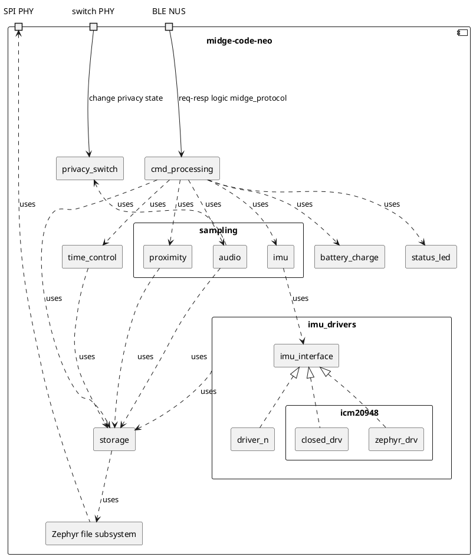

# Firmware

```puml
@startuml
'left to right direction
'Interface "midge_protocol" as ic

Component "midge-code-neo" {
    port "SPI PHY" as spi
    portin "switch PHY" as sw
    port "BLE NUS" as nus

    rectangle imu_drivers{
      rectangle imu_interface
      rectangle icm20948 {
        rectangle "closed_drv"
        rectangle "zephyr_drv"
      }
      rectangle "driver_n"
    }
together {
    rectangle sampling {
      rectangle proximity
      rectangle audio
      rectangle imu
    }
    rectangle battery_charge
    rectangle status_led
    rectangle time_control
}
together {
    rectangle privacy_switch
    rectangle cmd_processing as mcp
}
    rectangle storage
    rectangle "Zephyr file subsystem" as fatfs
    nus --> mcp: req-resp logic midge_protocol
    sw --> privacy_switch: change privacy state
    privacy_switch <.. audio: uses

    storage ..> fatfs: uses
    spi <.. fatfs: uses

    mcp ..> proximity: uses
    mcp ..> audio: uses
    mcp ..> imu: uses
    mcp ..> storage: uses
    mcp ..> battery_charge: uses
    mcp ..> time_control: uses

    audio ..> storage: uses
    proximity ..> storage: uses

    imu ..> imu_interface: uses
    imu_interface <|.. closed_drv
    imu_interface <|.. zephyr_drv
    imu_interface <|.. driver_n
    imu_drivers ..> storage: uses

    time_control ..> storage: uses

    mcp ..> status_led : uses

}
'together{
'  node SDMMC
'  node "Controller central"
'  node "Switch"
'}
'
'SDMMC -- spi
'"Controller central" -- ic
'ic -- nus
'"Switch" --  sw

@enduml
```

# Control Software
