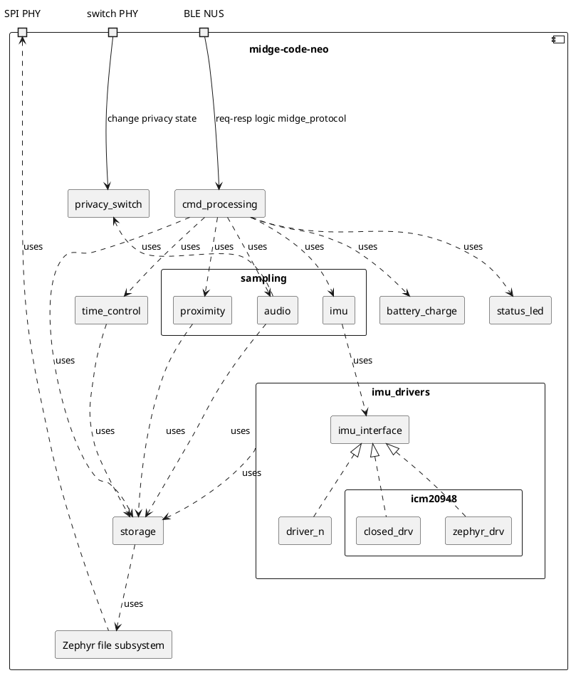
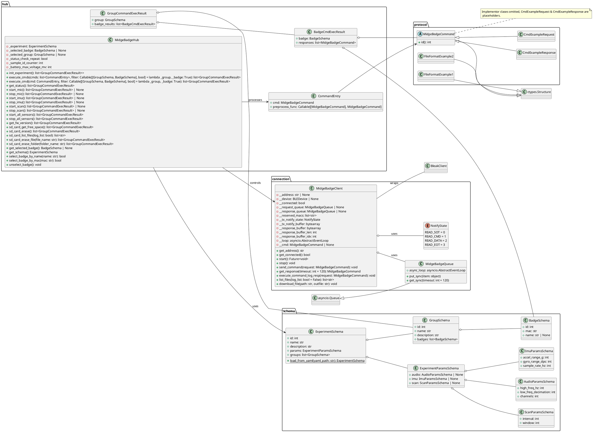

# Firmware

```puml
@startuml
'left to right direction
'Interface "midge_protocol" as ic

Component "midge-code-neo" {
    port "SPI PHY" as spi
    portin "switch PHY" as sw
    port "BLE NUS" as nus

    rectangle imu_drivers{
      rectangle imu_interface
      rectangle icm20948 {
        rectangle "closed_drv"
        rectangle "zephyr_drv"
      }
      rectangle "driver_n"
    }
together {
    rectangle sampling {
      rectangle proximity
      rectangle audio
      rectangle imu
    }
    rectangle battery_charge
    rectangle status_led
    rectangle time_control
}
together {
    rectangle privacy_switch
    rectangle cmd_processing as mcp
}
    rectangle storage
    rectangle "Zephyr file subsystem" as fatfs
    nus --> mcp: req-resp logic midge_protocol
    sw --> privacy_switch: change privacy state
    privacy_switch <.. audio: uses

    storage ..> fatfs: uses
    spi <.. fatfs: uses

    mcp ..> proximity: uses
    mcp ..> audio: uses
    mcp ..> imu: uses
    mcp ..> storage: uses
    mcp ..> battery_charge: uses
    mcp ..> time_control: uses

    audio ..> storage: uses
    proximity ..> storage: uses

    imu ..> imu_interface: uses
    imu_interface <|.. closed_drv
    imu_interface <|.. zephyr_drv
    imu_interface <|.. driver_n
    imu_drivers ..> storage: uses

    time_control ..> storage: uses

    mcp ..> status_led : uses

}
'together{
'  node SDMMC
'  node "Controller central"
'  node "Switch"
'}
'
'SDMMC -- spi
'"Controller central" -- ic
'ic -- nus
'"Switch" --  sw

@enduml
```

# Control Software

```puml
@startuml
left to right direction

package hub {
	class MidgeBadgeHub {
		-_experiment: ExperimentSchema
		-_selected_badge: BadgeSchema | None
		-_selected_group: GroupSchema | None
		-_status_check_repeat: bool
		-_sample_id_counter: int
		-_battery_max_voltage_mv: int
		+init_experiment(): list<GroupCommandExecResult>>
		+execute_cmds(cmds: list<CommandEntry>, filter: Callable[[GroupSchema, BadgeSchema], bool] = lambda _group, _badge: True): list<GroupCommandExecResult>
		+execute_cmd(cmd: CommandEntry, filter: Callable[[GroupSchema, BadgeSchema], bool] = lambda _group, _badge: True): list<GroupCommandExecResult>
		+get_status(): list<GroupCommandExecResult>
		+start_mic(): list<GroupCommandExecResult> | None
		+stop_mic(): list<GroupCommandExecResult> | None
		+start_imu(): list<GroupCommandExecResult> | None
		+stop_imu(): list<GroupCommandExecResult> | None
		+start_scan(): list<GroupCommandExecResult> | None
		+stop_scan(): list<GroupCommandExecResult> | None
		+start_all_sensors(): list<GroupCommandExecResult>
		+stop_all_sensors(): list<GroupCommandExecResult>
		+get_fw_version(): list<GroupCommandExecResult>
		+sd_card_get_free_space(): list<GroupCommandExecResult>
		+sd_card_erase(): list<GroupCommandExecResult>
		+sd_card_list_files(log_list: bool): list<str>
		+sd_card_erase_file(file_name: str): list<GroupCommandExecResult>
		+sd_card_erase_folder(folder_name: str): list<GroupCommandExecResult>
		+get_selected_badge(): BadgeSchema | None
		+get_schema(): ExperimentSchema
		+select_badge_by_name(name: str): bool
		+select_badge_by_mac(mac: str): bool
		+unselect_badge(): void
	}

	class CommandEntry {
		+cmd: MidgeBadgeCommand
		+preprocess_func: Callable[[MidgeBadgeCommand], MidgeBadgeCommand]
	}

	class BadgeCmdExecResult {
		+badge: BadgeSchema
		+responses: list<MidgeBadgeCommand>
	}

	class GroupCommandExecResult {
		+group: GroupSchema
		+badge_results: list<BadgeCmdExecResult>
	}
}

package connection {
	enum NotifyState {
		READ_SOT = 0
		READ_CMD = 1
		READ_DATA = 2
		READ_EOT = 3
	}

	class MidgeBadgeClient {
		-__address: str | None
		-__device: BLEDevice | None
		-__connected: bool
		-__request_queue: MidgeBadgeQueue | None
		-__response_queue: MidgeBadgeQueue | None
		-__reserved_macs: list<str>
		-__tx_notify_state: NotifyState
		-__tx_notify_buffer: bytearray
		-__response_buffer: bytearray
		-__response_buffer_len: int
		-__response_buffer_idx: int
		-__loop: asyncio.AbstractEventLoop
		-__cmd: MidgeBadgeCommand | None
		+get_address(): str
		+get_connected(): bool
		+start(): Future<void>
		+stop(): void
		+send_command(request: MidgeBadgeCommand): void
		+get_response(timeout: int = 120): MidgeBadgeCommand
		+execute_command_log_resp(request: MidgeBadgeCommand): void
		+list_files(log_list: bool = False): list<str>
		+download_file(path: str, outfile: str): void
	}

	class MidgeBadgeQueue {
		+async_loop: asyncio.AbstractEventLoop
		+put_sync(item: object)
		+get_sync(timeout: int = 120)
	}
}

package protocol {
	abstract class MidgeBadgeCommand {
		+id(): int
	}

	class CmdExampleRequest
	class CmdExampleResponse
	class FileFormatExample1
	class FileFormatExample2
}

package schema {
	class ExperimentSchema {
		+id: int
		+name: str
		+description: str
		+params: ExperimentParamsSchema
		+groups: list<GroupSchema>
        +{static} load_from_yaml(yaml_path: str): ExperimentSchema
	}

	class ExperimentParamsSchema {
		+audio: AudioParamsSchema | None
		+imu: ImuParamsSchema | None
		+scan: ScanParamsSchema | None
	}

	class AudioParamsSchema {
		+high_freq_hz: int
		+low_freq_decimation: int
		+channels: int
	}

	class ImuParamsSchema {
		+accel_range_g: int
		+gyro_range_dps: int
		+sample_rate_hz: int
	}

	class ScanParamsSchema {
		+interval: int
		+window: int
	}

	class GroupSchema {
		+id: int
		+name: str
		+description: str
		+badges: list<BadgeSchema>
	}

	class BadgeSchema {
		+id: int
		+mac: str
		+name: str | None
	}
}

class "ctypes.Structure" as ctypesStructure
class "asyncio.Queue" as asyncioQueue
class BleakClient

ctypesStructure <|-- MidgeBadgeCommand
asyncioQueue <|-- MidgeBadgeQueue
FileFormatExample1 --|> ctypesStructure
FileFormatExample2 --|> ctypesStructure
MidgeBadgeCommand <|-- CmdExampleRequest
MidgeBadgeCommand <|-- CmdExampleResponse

MidgeBadgeClient o-- NotifyState : uses
MidgeBadgeClient o-- MidgeBadgeQueue : uses
MidgeBadgeClient -- BleakClient : wraps

CommandEntry --> MidgeBadgeCommand
BadgeCmdExecResult o-- BadgeSchema
BadgeCmdExecResult o-- MidgeBadgeCommand
GroupCommandExecResult o-- GroupSchema
GroupCommandExecResult o-- BadgeCmdExecResult

ExperimentSchema o-- ExperimentParamsSchema
ExperimentParamsSchema o-- AudioParamsSchema
ExperimentParamsSchema o-- ImuParamsSchema
ExperimentParamsSchema o-- ScanParamsSchema
ExperimentSchema o-- GroupSchema
GroupSchema o-- BadgeSchema

MidgeBadgeHub --> ExperimentSchema : uses
MidgeBadgeHub --> MidgeBadgeClient : controls
MidgeBadgeHub --> CommandEntry : processes

note right of MidgeBadgeCommand
	Implementor clases omitted, CmdExampleRequest & CmdExampleResponse are
  placeholders.
end note

@enduml
```
