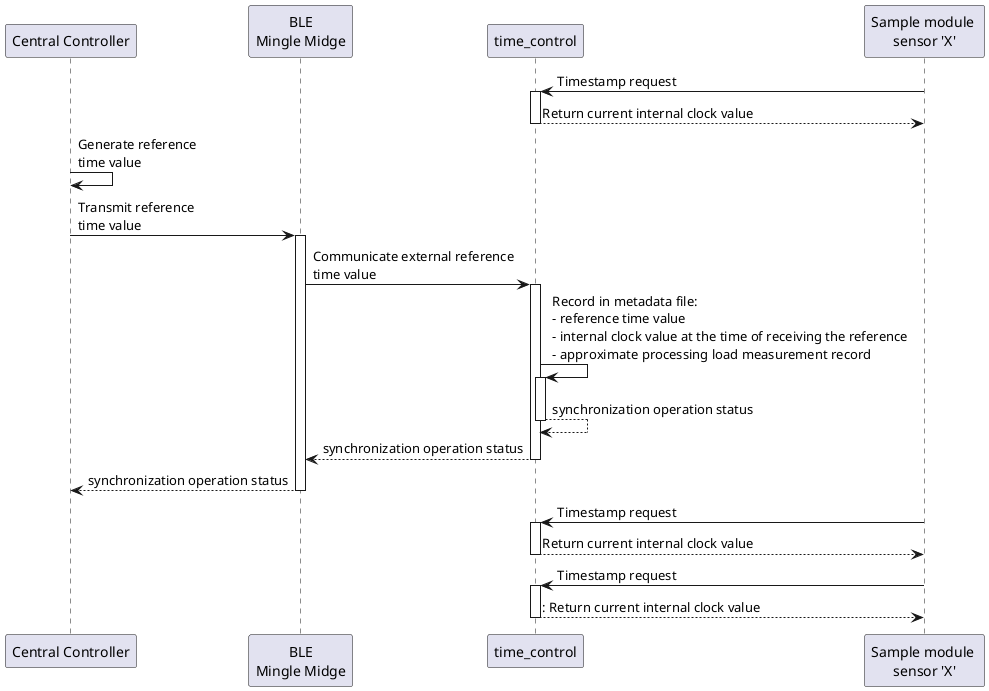

# Commands

WIP

# Files

WIP

# TimeSync

```puml
@startuml
participant "Central Controller" as CC
participant "BLE\nMingle Midge" as MM
participant "time_control" as TC
participant "Sample module \nsensor 'X'" as MMU


MMU -> TC ++ : Timestamp request
return Return current internal clock value
CC -> CC: Generate reference\ntime value
CC -> MM ++: Transmit reference\ntime value
MM -> TC ++: Communicate external reference\ntime value
TC -> TC ++: Record in metadata file:\n- reference time value\n- internal clock value at the time of receiving the reference\n- approximate processing load measurement record
return  synchronization operation status
return  synchronization operation status
return  synchronization operation status

MMU -> TC ++: Timestamp request
return Return current internal clock value

MMU -> TC ++: Timestamp request
return: Return current internal clock value

@enduml
```
