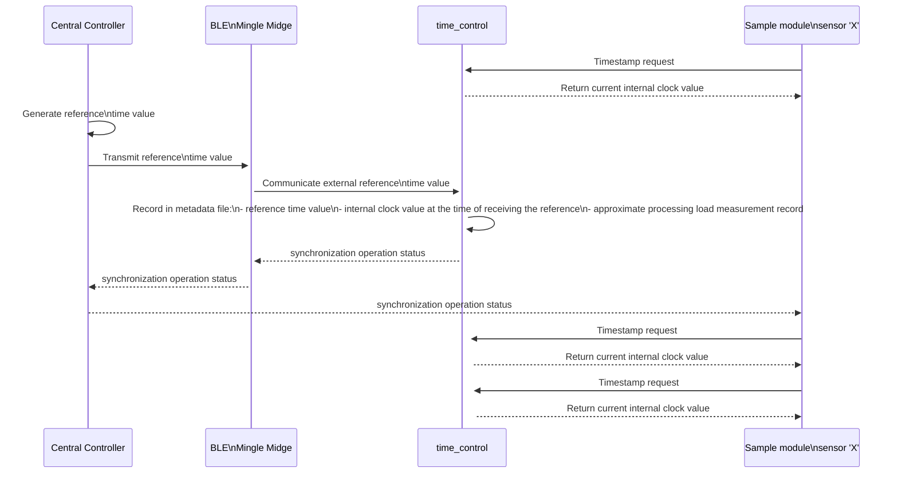

# Commands

```C
--8<-- "firmware/application/src/midge_protocol.h:35:211"
```

# Files

```C
--8<-- "firmware/application/src/midge_protocol.h:215:252"
```

# TimeSync


```mermaid
sequenceDiagram
participant CC as Central Controller
participant MM as BLE\nMingle Midge
participant TC as time_control
participant MMU as Sample module\nsensor 'X'


MMU ->>+ TC : Timestamp request
TC -->> MMU : Return current internal clock value
CC ->> CC : Generate reference\ntime value
CC ->>+ MM : Transmit reference\ntime value
MM ->>+ TC : Communicate external reference\ntime value
TC ->>+ TC : Record in metadata file:\n- reference time value\n- internal clock value at the time of receiving the reference\n- approximate processing load measurement record
TC -->> MM : synchronization operation status
MM -->> CC : synchronization operation status
CC -->> MMU : synchronization operation status

MMU ->>+ TC : Timestamp request
TC -->> MMU : Return current internal clock value

MMU ->>+ TC : Timestamp request
TC -->> MMU : Return current internal clock value
```
