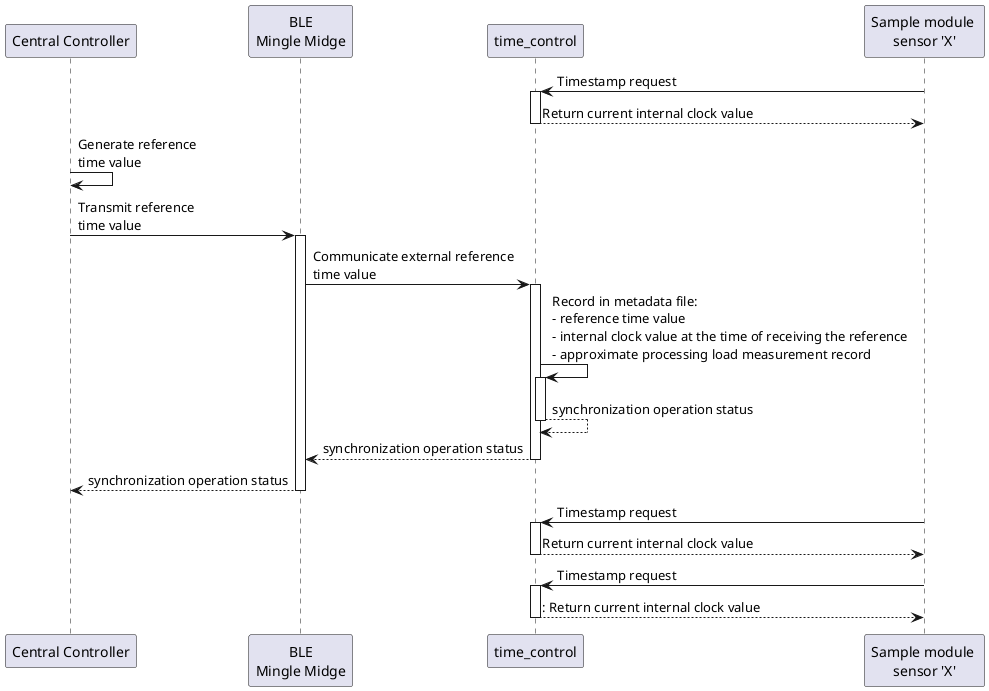

# Protocol

## Commands

### IDs

```C
--8<-- "firmware/application/src/midge_protocol.h:35:53"
```

### Requests and responses format

```C
--8<-- "firmware/application/src/midge_protocol.h:54:211"
```

## Sensors

### Sensor status meaning

```C
--8<-- "firmware/application/src/midge_protocol.h:13:18"
```

## Files

### Storage status meaning

```C
--8<-- "firmware/application/src/storage.h:14:23"
```

> If unfamiliar with C, the bitfields are enumerated from LSB to MSB

### File type list.

```C
--8<-- "firmware/application/src/storage.h:25:37"
```

> ID of the file type maps to bit position in the `active_sensor_bitflags`
  embedded on the advertising data


### Raw file entry formats

#### Audio files and ID.TXT

Use as is.

#### Others

```C
--8<-- "firmware/application/src/midge_protocol.h:215:252"
```

## TimeSync


